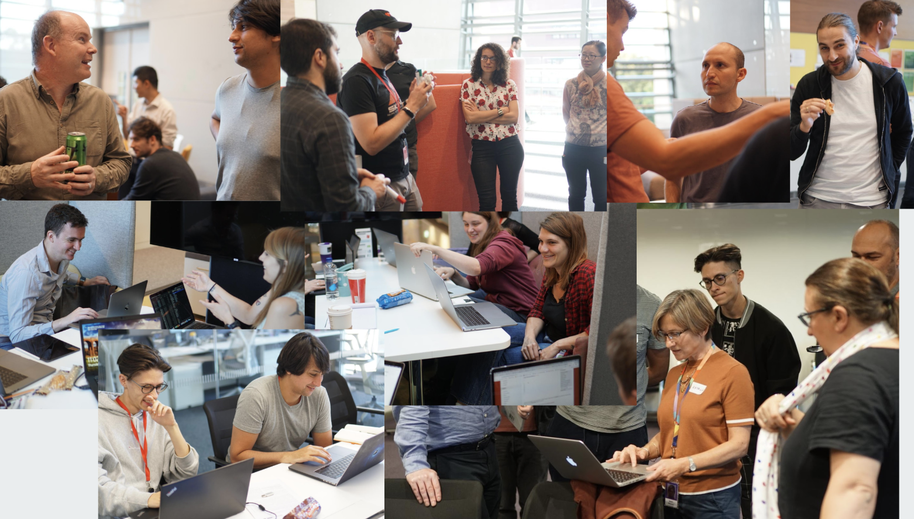

## Our next event is the 21st-23rd October 2020

Crick Data Challenge #3 will be coming your way at the end of October, so [put the date in your diary!](http://www.google.com/calendar/event?action=TEMPLATE&dates=20200527T160000Z%2F20200529T173000Z&text=Crick%20Data%20Challenge&location=Francis%20Crick%20Institute&details=Hackathon-style%20event%20fostering%20collaborations%20between%20wet%20lab%20biologists%20and%20data%20scientists.%20Hosted%20at%20the%20Francis%20Crick%20Institute.) 

Sign up is now open! [Register](https://forms.gle/W6G61BdDvWRTvTBz5) as a participant and if you like, propose a project!

#### How does this all work?

In the run up to the 21st October Crick scientists are encouraged to submit projects to us. Examples of previously successful projects include:
* Creation of a program with a user interface to design antisense oligonucleotides.
* Integration of huge amounts of cancer RNA-Seq data in order to identify genes that could be therapeutic targets.
* Design of a method to categorise and classify spherical cell images from a magnetic tweezer microscope system.
* Investigation of Drosophila fruit preferences using chemical, behavioural and electrophysiological data sets.
* Implementation of a streamlined pipeline for analysing highly complex, multi-dimensional imaging data.

We select 4-5 of these projects. On the morning of Wednesday 21st October, project leads will pitch the projects to the participants. In the past we have kept projects entirely secret until this time, but this time around we will let you know the themes of the different projects to help you decide if you want to come. You then have a chance to think about which team you want to join. That afternoon you will form teams and work until Friday on the project. On Friday afternoon, your group will present a short presentation about what you have achieved/learnt!

For more information about how the event works, please check out our introductory slides from [Data Challenge #2](https://docs.google.com/presentation/d/1Ey5_b0nZZoQQO_7Mdljbz7ckRt1TbFOYxzhY6hWwFMc/edit?usp=sharing).

If you have any questions at all, please email data-challenge@crick.ac.uk and we will get back to you.

All attendees at our events must adhere to our [code of conduct](code-of-conduct.md).

---

### Thoughts from previous participants...
 

**_Lucia Prieto-Godino, Group leader_**

>“The Crick Data Challenge is a great initiative; as soon as I heard about it I decided to join and encouraged my students to do so. We are lucky to work in such a multidisciplinary environment at the crick. Each discipline has classical ways to analyse data and we often do not go beyond these. However, by looking at our data from a different perspective we might gain novel biological insights.”

**_Febe van Maldegem, Downward lab_**

>"I can’t thank my team enough for all the effort they put into working on our project. It’s unbelievable how much we achieved in just two days. Now we can start focusing on the results, rather than the data processing.”

---

